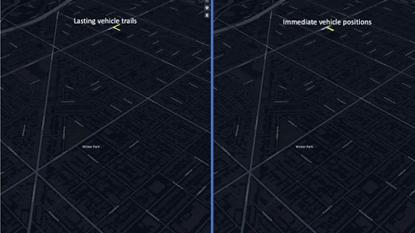

# Multi-Agent Routing Value Iteration Network (MARVIN)



This is the official repo for MARVIN implemented in pytorch. For more details on our findings and the results, to learn more about the findings of this work, please check out our [paper](http://github.com) and our [blog post](http://github.com)

In this work, we address the problem of routing multiple agents in a coordinated manner, specifically in the context of autonomous mapping. We created a simulated environment to mimic realistic mapping performed by autonomous vehicles with unknown minimum edge coverage and traffic conditions.
Here you can find our training code both for training with reinforcement learning and with imitation learning.

## Requirements
 - Python>=3.6
 - tqdm>=4.36.1
 - torch==1.4.0
 - tensorboardX>=1.9
 - numpy>=1.18.1
 - cvxpy==1.1.0a1
 - scipy==1.4.1

 ## Setup

 In a new python environment, run the following command to install all dependencies.

 ```
 python setup.py install
 ```

 ## Training
 - Step 1: Download the data
 ```
 bash download.sh
 ```
 It should be able to be found in the ```marvin/data``` folder

 - Step 2: Begin training
```
python train.py --tag <your-unique-tag>
```

This will train the system on a set of static graphs from our dataset. In order to add in our realistic traffic conditions, run

```
python train.py --tag <your-unique-tag> --traffic --pass_range 3
```

If you want to train the system using reinforcement learning, add the ```--rl``` tag as an argument

```
python train.py --tag <your-unique-tag> --traffic --pass_range 3 --rl
```

Note that the kind of trainer and many of the other hyperparameters can be found in ```marvin/utils/trainer_parameters.py```. Feel free to play around with them as you see fit. In order to set the seed for the entire setup for reproducibility, use the ```--seed``` argument.

## Testing

In order to evaluate a model, simple add the ```--eval``` and ```--load <path-to-model.pb>``` tags to your original training command. This will skip the training loop and only run the validation loop on the testset instead. The validation loop will also produce records of the previous set of runs in the ```logs/testing_data``` for visualization and future qualitative analysis.

```
python train.py --tag <your-unique-tag> --traffic --pass_range 3 --rl --eval --load <your-weights>
```

If you want to evaluate using our pretrained models, then run the following for our imitation learning model:

```
python train.py --tag <your-unique-tag> --traffic --pass_range 3 --eval --load marvin/pretrained/il.pb --seed 1
```

or the following to run our reinforcement learning model

```
python train.py --tag <your-unique-tag> --traffic --pass_range 3 --rl --eval --load marvin/pretrained/rl.pb --seed 1
```

## Results

Note that our results may not exactly match our paper since we have refactored this repository for understandibility, scaled down the numbers for readability, and tested with several random seeds, but when tested on models with a random seed of , we find the following results in terms of the average cost of a traversal:

Model        | 1 Agent 25 nodes | 2 Agents 25 Nodes | 2 Agents 50 nodes | 5 Agents 100 nodes
------------ | ---------------- | ----------------- | ----------------- | -------------
MARVIN IL    | 5216             | 5145              | 8089              | 16644
MARVIN RL    | 5037             | 5279              | 8382              | 16644

### Training Curves

Here we illustrate what training should look like for imitation learning (left) and reinforcement learning (right) when the seed is set to zero.

#### Loss

Here is the loss function (cross entropy for imitation learning and policy gradient loss for reinforcement learning)

 

#### Relative Performance

Here is how the relative performance of our model when compared to the ground truth optimal.

 

## Visualization

The value function that each agent creates can be visualized to determine what their intentions are and how they can evolve over time.


## TODO

- Parallelize training
- Generalize training environment
- Port to tensorflow
- Integrate path visualization functions into the codebase